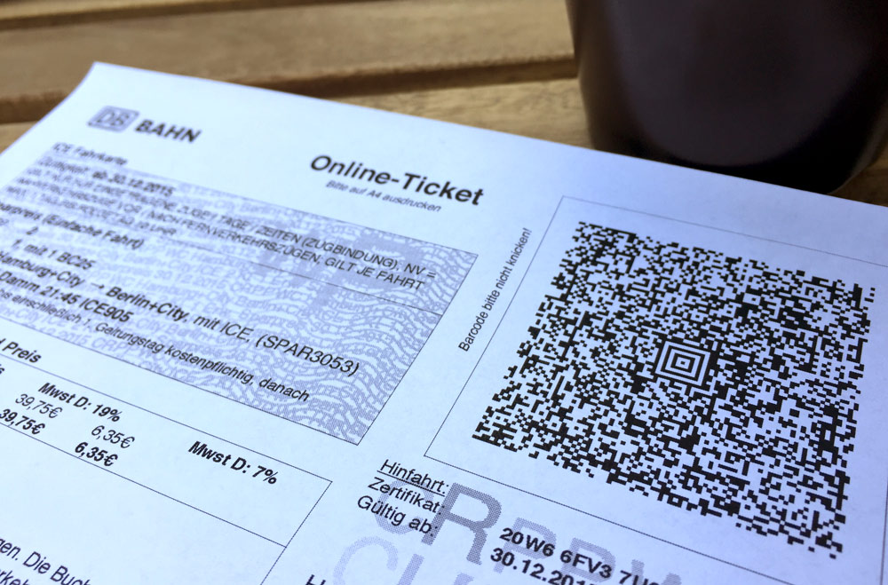

# ticket-parser

Have you ever travelled with an online ticket from Deutsche Bahn and wondered what information is inside the 2D code? This library tells you. (Note that it doesn't *read* the image of the Aztec code itself; wrapping around [zxing][zxing] is your best bet for that at the moment.)



```sh
npm install ticket-parser
```

## API

```js
const TicketParser = require('ticketparser');
TicketParser.parse(dataFromAztecCode)
	.then(ticket => { /* do something */ })
```

The API is asynchronous because TicketParser invokes `zlib` to decompress the payload. Parsing is currently done with the buffered payload, but the format lends itself very well to being parsed as a stream.

The returned Promise is rejected if no payload is found, otherwise it resolves with output like this:

```js
{
  version: "01",
  pnr: "QW2A66",
  issueDate: new Date("2015-06-24T15:44:00.000Z"),
  primaryLanguage: "DE",
  secondaryLanguage: "DE",
  identification: {
    carrier: "0080",
    type: "BahnCard", // === TicketParser.IDENTIFICATION_TYPES.BAHNCARD
    lastDigits: "1234"
  },
  fareName: "Sparpreis Aktion",
  productClass: {
    overall: "IC/EC", // === TicketParser.PRODUCT_CLASSES.IC
    outbound: "IC/EC",
    inbound: "IC/EC"
  },
  adults: 2,
  bahnCards: [
    {
      count: 2,
      type: "BahnCard 25" // === TicketParser.BAHNCARD_TYPES.BC25
    }
  ],
  children: 0,
  fareClass: "2",
  outbound: {
    from: "Berlin+City",
    to: "Freiburg(Brsg)+City"
  },
  inbound: {
    from: "Freiburg(Brsg)+City",
    to: "Berlin+City"
  },
  via: "H: B-Hbf 22:14 CNL1258-IC61258 R: FR-Hbf 21:58 CNL40459",
  owner: {
    fullName: "Beispiel Sofie",
    firstName: "Sofie",
    lastName: "Beispiel"
  },
  fareType: "Sparpreis", // === TicketParser.FARE_TYPES.SAVER
  identificationNumber: "***************1234",
  valid: {
    from: new Date("2015-06-30T22:00:00.000Z"),
    until: new Date("2015-07-01T22:00:00.000Z")
  },
  stationIds: {
    from: "11160",
    to: "107"
  },
  carrier: "0080",
  certificates: [
    {
      id: "208XEFFLLM3",
      validFrom: new Date("2015-06-30T22:00:00.000Z"),
      validUntil: new Date("2015-07-01T22:00:00.000Z"),
      serialNumber: "1234567890"
    },
    {
      id: "208AQRNBBE4",
      validFrom: new Date("2015-07-02T22:00:00.000Z"),
      validUntil: new Date("2015-07-03T22:00:00.000Z"),
      serialNumber: "1234567890"
    }
  ]
}
```

## Limitations

Because the specification is not public, all the information has been gained through reverse-engineering; mainly thanks to [the efforts of rumpeltux][rumpeltux]. Most things work, nothing's guaranteed.

Some information is not contained in the Aztec code, notably prices and seat reservations. If you care about those, you'll have no choice but to parse the text in the PDF.

TicketParser currently ignores extensions such as the "+City Ticket" or "Ländertickets", even though that is part of the encoded information.

TicketParser does not and cannot check if a ticket is genuine. Each ticket is cryptographically signed (almost certainly using asymmetric encryption), but the public key is, well, not public. TicketParser currently throws away the signature – if you have the means of verifying it, you probably also have better means of parsing the ticket.

[zxing]: https://github.com/zxing/zxing
[rumpeltux]: https://github.com/rumpeltux/onlineticket/blob/master/onlineticket.py
